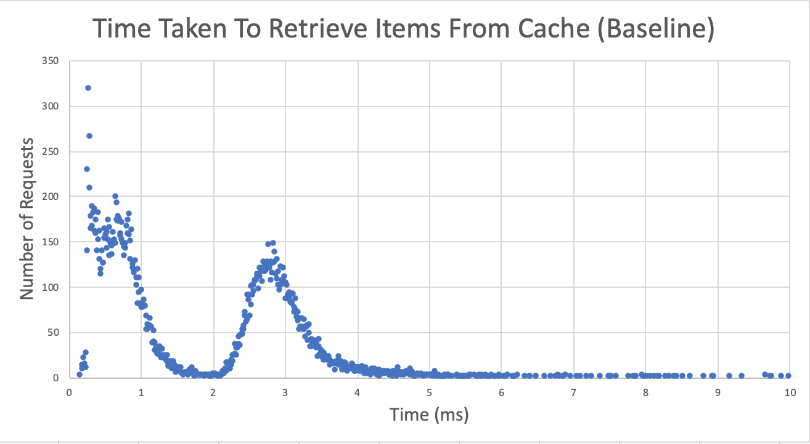

# CSCI 389 Homework #5: Lies, statistics, and benchmarks
## Created by Maxx Curtis and Casey Harris

## VARIOUS NOTES:
	- We use Reilly and James' LRU Evictor for this project.
	
## PART 1 - WORKLOAD GENERATION:
	This cache is meant to model Facebook's Memcached, but we have made a variety
	of assumptions that do not necessarily conform to that system.
		- Our system for selecting keys to get() uses an exponential distribution to give
			the majority of the weight to the first keys entered into use, with new keys
			becoming less commonly gotten as the list of used keys grows. This does not
			necessarily match with Memcached, where popular keys might be interspersed
			among less popular ones.
		- We don't have a backend server that can supply us with data when a get() misses,
			so we've weighted delete requests to target infrequently used keys (keys at 
			the back of the key list) more often than commonly used keys. This is to
			simulate get() refreshing the cache with data on a miss, as a deleted common
			key would be re-introduced to the cache quickly, while an uncommonly used one
			might be gone for a long time. It is still possible that we will delete() a
			popular key early, though, which would tank the hit rate for that trial.
		- We had trouble with connection issues in HW4, so our workaround was to create a
			new stream for every request instead of continuing to operate on a single
			stream. This does not appear to cause problems regarding correctness, but it
			may slow the program down.
		- We use probabilites to decide which cache function (get, set, or delete) to call 
			and also whether to have that function operate on a key that we expect to be in
			the cache or one that doesn't exist. These numbers may not be a perfect match
			for Memcached's actual workload.
		- On a related note, when manufacturing new keys, we randomly generate strings of
			certain lengths and content (all capital letters for keys, all lowercase letters
			for data). This means that there is a very small chance that we will generate
			a "new" item that actually does already exist in the cache. We have adjusted the
			creation of objects such that the chance is minimal, and even if we do generate
			a key that already exists, it should not pose performance problems.
		- Our data sizes fall into three brackets; small (2-7 characters), medium (10-44
			characters), and large (100-114 characters). These attempt to model the varying
			data sizes in Memcached, but changing the numbers may be required to make a
			faithful model.

## PART 2 - BASELINE LATENCY AND THROUGHPUT:
	For our plot, we used a scatter plot where the x axis is the length of time it took to
	complete a request (in milliseconds, rounded to the nearest hundredth) and the y axis is 
	the number of requests that took that amount of time (out of 10000 total requests). The 
	displayed graph has cropped off some of the extreme outliers in the 10-17 millisecond 
	range, as they condensed the data and made trends harder to discern.

	
	One notable feature about this graph is its slope as the request time rises. A lot of
	requests took very little time, being retrieved in half a second or less. Between that
	spike and 2 milliseconds, there are very few requests, but it picks up again and a second,
	smaller peak occurs around 2 milliseconds before tapering off. We believe that this is
	due to the cache's maxmem (1024 bytes) exceeding the size of the computer's L1 cache. 
	This means that some values in the cache are actually stored in the L1 cache, which 
	handles requests quickly, but others are in the L2 cache, making operations on those keys
	take longer.	

## PART 3 - SENSITIVITY TESTING:
	All tests are run on a randomized workload of 50,000 requests.
	Although results such as Mean Throughput and Average Request Time are fairly consistent 
	over as few as 10,000 requests, we've chosen 50,000 to minimize noise.
	Higher values (over 100,000) take prohibitively long to run, and the slight accuracy gained 
	is outweighed by the time saved.

	Parameters To Vary: 
		- Eviction Policy
				(FIFO vs LRU eviction)
		- Maximum Cache Memory
		- Load Factor
		- Compiler Options
				(Opimization level)
	
### Baseline Parameters:

	Maxmem: 1024 bytes
	Eviction Policy: LRU
	Load Factor: 0.75
	g++ Optimization: 03

	Warmup: ~200 requests for Cache size of 1024
		Sets: 90%
			New key generation: 100%
		Gets: 10% (Intended to warmup LRU or similar eviction policy)
			Intended misses: 0%

	Workload Requests: 50,000
		Gets: 67%  
			Exponential distribution with a Lambda of 6 (result divided by 3)
			Intended misses: 10%

		Deletes: 31% 
			Exponential distribution with a Lambda of 6 (result divided by 3)
			Intended misses: 90%

		Sets: 2%
			Sizes:
				2-8: 95%
				10-45: 4%
				100-115: 1%
			New key generation: 3%

### Baseline Performance: (50K Requests)

	'get' Hit Rate: 88 %
	Mean throughput: 617.848 Requests per second
	95th Percentile Latency: 12.24ms
	Average Request Time: 1.619 ms

### Eviction Policy Tests:

	LRU Evictor: (Baseline above)

	FIFO_Evictor:
		'get' Hit Rate: 88 %
		Mean throughput: 605.469 Requests per second
		95th Percentile Latency: 11.53 ms
		Average Request Time: 1.652 ms

	Across the board, FIFO_Evictor was slower than LRU, but not very. 
	And Get Hit Rate, the value we expected to change most significantly, was 
	completely unaffected by the change. This lack of response to likely due 
	to our low rate of sets, which only comprise 2% of all requests, and only 
	3% of which are new keys. Even over 50,000 requests, the amount of values 
	evicted from the cache would be relatively low. Even though our 'popular' 
	values are set first and are therefore the most likely to be evicted, the 
	rate is low enough to negligable.

### Maximum Cache Memory

	1024 Bytes: (Baseline above)

	512 Bytes: 
		'get' Hit Rate: 87.7 %
		Mean throughput: 587.462 Requests per second
		95th Percentile Latency: 12.52 ms
		Average Request Time: 1.702 ms

	2048 Bytes: 
		'get' Hit Rate: 88.8 %
		Mean throughput: 599.677 Requests per second
		95th Percentile Latency: 11.56 ms
		Average Request Time: 1.668 ms

		Other than the slight increase in hit rate due to its large size, the size 
		2048 cache was comparable to the baseline. The slight dip in Mean Throughput 
		is to be expected, as it would have to sort through roughly twice as many key 
		for every get.
		Notably, the size 512 cache was slower than the basline by a difference of ~30 
		requests per second. This is a small difference, but the reaction defies what we 
		would expect. A smaller cache should have much faster search times for keys, and 
		thus a slightly faster throughput, yet the inverse is true for our cache.

### Load Factor

	0.75: (Baseline above)

	0.5:
		'get' Hit Rate: 88.8 %
		Mean throughput: 613.145 Requests per second
		95th Percentile Latency: 10.15 ms
		Average Request Time: 1.631 ms

	0.9: 
		'get' Hit Rate: 88.5 %
		Mean throughput: 597.239 Requests per second
		95th Percentile Latency: 13.5 ms
		Average Request Time: 1.674 ms

		These changes are small, and behave as expected.
		Decreasing the load factor results in more frequent rehashing of the cache, 
		which would accrue a small overhead over time, but result in fewer edge-cases in 
		which a value takes a long time to find. This results in a slightly lower Mean 
		Throughput, but a corresondingly lower 95th Percentile Latency.
		Increasing the load factor has an inverse effect on the 95th Percentile Latency, 
		as it becomes more likely that some keys will take significantly longer to retrieve. 
		It also resulted in a slightly lower Mean Throughput than either of the other test cases. 
		This is likely due to the overall negative impact on search times for keys in an 
		infrequently-hashed cache.

### Compilation Options

	-O3: (Baseline above)

	-O0: 
		'get' Hit Rate: 88.5% %
		Mean throughput: 477.146 Requests per second
		95th Percentile Latency: 12.8 ms
		Average Request Time: 2.096 ms

	-Os: 
		'get' Hit Rate: 88.5 %
		Mean throughput: 582.353 Requests per second
		95th Percentile Latency: 12.47 ms
		Average Request Time: 1.717 ms

	-Ofast: 
		'get' Hit Rate: 88.1 %
		Mean throughput: 511.869 Requests per second
		95th Percentile Latency: 13.23 ms
		Average Request Time: 1.953 ms

		As expected, '-O0' (no additional optimization) had negligable effect on the cache's hit rate, 
		but a massive, negative impact on its Mean Throughput and average speed.
		'Os', which optimizes for minimal memory use instead of runtime speed, had a surprisingly small 
		impact on the cache's average speed, though as we would expect, it had no impact on the hit rate. 
		We can only assume that memory efficiency of 'Os' is able to make up for the lack optimization, 
		resulting in only a modest decrease in speed.
		'Ofast', which should represent the highest level of runtime speed optimization, actually performed 
		worse than both the baseline and 'Os'. This result is wholly unexpected.
		According to gnu's own documentation: https://gcc.gnu.org/onlinedocs/gcc/Optimize-Options.html
		'Ofast' is "not valid for all standard-compliant programs", and we assume that this significant 
		speed decrease is the result of an incompatiability between the Ofast flags and one or more of our 
		included libraries.
